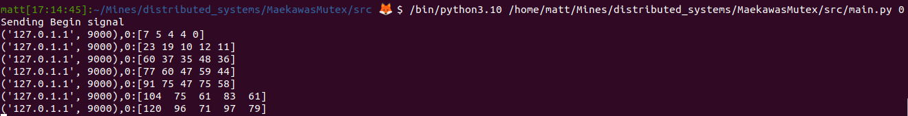

# Maekawa's Mutex :cloud::lock:

## Project 2 - Maekawa's Distributed Mutex
Author: Matt Desaulniers & Ryan Hartzell
Date:   OCT 7 2024

NOTE: PLEASE RENDER THIS README AS MARKDOWN

## Description
This project implements a distributed mutex (or lock) which protects a resource from being accessed concurrently by multiple nodes in a network. The Maekawa algorithm forms groups of Nodes which we will call quorum subsets $S_i$, with a subset assigned to each $Node_i$ in the network, and subject to the constraint that all constructed subsets must have at least one intersection with all other subsets. A $Node_i$ is allowed to request access to its critical section by sending a multicast REQUEST message to its assigned subset's multicast address on the network. $\forall$ Node $j \ne i$ a REPLY message is sent back to Node $i$ I.F.F. $Node_j$ is not "locked" (aka, the Node $j$ has already given its permission to access the critical section to another $Node_k$). Once a Node has acquired the critical section (received REPLY from each member Node of its associated quorum), it will perform its critical section processing, and then send a final RELEASE message telling all of its associated quorum Nodes to unlock themselves, making them available to send REPLY messages for the next REQUEST on each of they're queues. Additionally, the VectorClock implementation in combination with each Node instance's Priority Queue ensures that the Critical Section is only accessed in order of REQUEST messages sent.

## Setup 

There are only two requirements for running this project:

1. Install (or have access to) >= Python 3.10
    - This is necessary as we use switch statements in our code and is trivial to alt install via apt on Ubuntu
2. Install numpy, the only third-party library we used. Assuming Linux OS:
    ```bash
    cd /path/to/MaekawasMutexProjectRoot
    python3.10 -m venv venv_maekawa
    source ./venv_maekawa/bin/activate
    pip install numpy
    ```

## Relevant Modules and Classes

* src/main.py
    - Main entrypoint into our program. Instructions for use below, but initalizes each Node (one per run) and provides access to Interface functions through the CDistributedMutex class.

* src/mutual_exclusion/IDistributedMutex.py
    - Message Enum class
        - Defines the enum for each message type
    - CDistributedMutex class
        - Contains all networking send and receive methods and sockets
        - Contains a vector clock instance
        - Manages lock via Project specified interface

* src/mutual_exclusion/vectorclock.py
    - Contains class implementing VectorClock timestamps, an overloaded comparator for use in Priority Queues, and code for update/increment of the clock.

* src/quorum_generator/quorum_generator.py
    - Contains functions for generating sets of Nodes for Maekawa

## Usage and Examples

The program uses a pretty basic CLI, which follows this syntax:

```bash
cd /path/to/MaekawasMutexProjectRoot
python3.10 ./src/main.py HOST_ID
```

Where HOST_ID is an integer $i \in [0..N]$, where N is the maximum number of Nodes in the network. For our implementation we've hardcoded the maximum number of Nodes as 5. Some notes about global initialization and how our implementation knows to begin execution of the Maekawa distributed locking mechanism.

1. Run the above command from separate terminal shells on either the same machine or different machines, BUT DO NOT RUN WHICHEVER NODE IS THE *MASTER NODE* = 0.

2. All Nodes with an id $\ne$ 0 will wait for a "Begin Signal" message to be broadcast to all Nodes in the network from the *MASTER NODE* with id = 0. Once received, all Nodes in the network will enter their respective CDistributedMutex.run() methods, and will begin sending and receiving messages.

3. Nodes by default will submit up to their total number of requests, while handling all incoming requests per Maekawa. Note that each Node has randomized access frequency (request rate) and duration (time spent in critical section) for more representative system simulation.

4. Output each time a Node accesses its critical section will follow the syntax "NODE_ADDRESS,NODE_ID:VECTOR_CLOCK_TIMESTAMP", as shown in the figure below. This is an example output of the *MASTER NODE* of our program, $Node_0$:


4. Once a Node has sent all its requests and either received permission to enter their critical section or have timed out per each request, it will enter a default "listen only" mode, such that we do not block all other active requests from finishing for other Nodes.

5. Each process can be killed via a CTRL-C, per usual, which will clean-up all sockets and objects.

Have fun!
